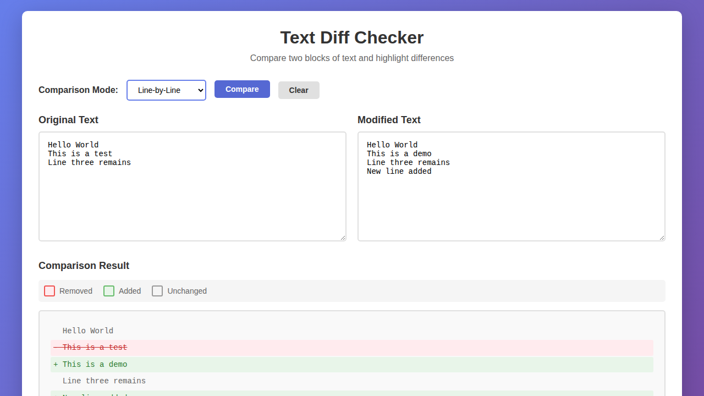
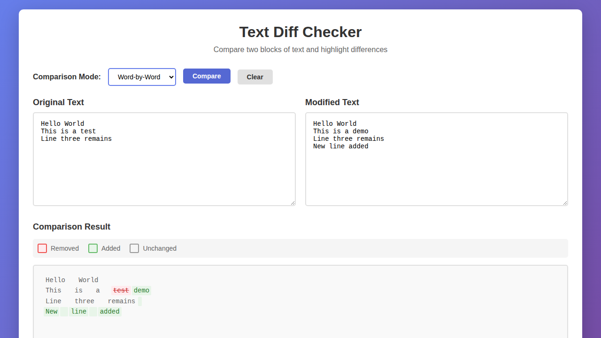

# Text Diff Checker

A web-based tool to compare two blocks of text and highlight differences with support for line-by-line and word-by-word comparison modes.





## Features

- **Line-by-Line Mode**: Compare texts line by line, showing which lines were added, removed, or unchanged
- **Word-by-Word Mode**: Compare texts word by word for more granular differences
- **Visual Highlighting**: 
  - 🔴 Red background for removed content
  - 🟢 Green background for added content
  - ⚪ Gray for unchanged content
- **Clean Interface**: Simple and intuitive user interface
- **Responsive Design**: Works on desktop and mobile devices

## Usage

1. Open `index.html` in your web browser
2. Enter your original text in the left text area
3. Enter your modified text in the right text area
4. Select comparison mode (Line-by-Line or Word-by-Word)
5. Click "Compare" to see the differences highlighted
6. Click "Clear" to reset all fields

## How It Works

The diff checker uses the **Longest Common Subsequence (LCS)** algorithm to find the differences between two texts:

- In **Line-by-Line mode**, it splits texts by newlines and compares each line
- In **Word-by-Word mode**, it splits texts by whitespace and compares each word
- The algorithm identifies additions (present in modified text), removals (present in original text), and unchanged portions

## Files

- `index.html` - Main HTML structure and interface
- `styles.css` - Styling and visual design
- `diff.js` - Diff algorithm implementation and logic

## Example

**Original Text:**
```
Hello World
This is a test
```

**Modified Text:**
```
Hello World
This is a demo
```

**Result (Line-by-Line):**
- Line 1: Unchanged
- Line 2: Removed "This is a test", Added "This is a demo"

## License

MIT License - See LICENSE file for details
